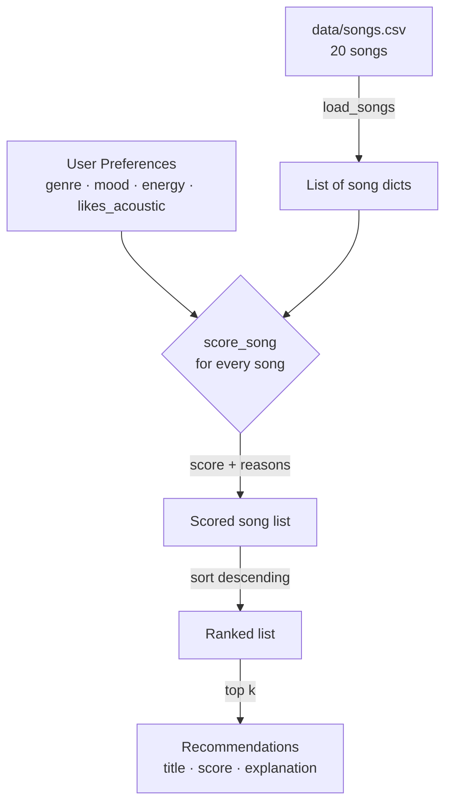

# 🎵 Music Recommender Simulation

## Project Summary

In this project you will build and explain a small music recommender system.

Your goal is to:

- Represent songs and a user "taste profile" as data
- Design a scoring rule that turns that data into recommendations
- Evaluate what your system gets right and wrong
- Reflect on how this mirrors real world AI recommenders

This version implements a **content-based filtering** recommender. It compares a user's stated preferences (genre, mood, and energy level) directly against the attributes of each song in the catalog, computes a weighted score for every song, and returns the top matches. Unlike collaborative filtering — which infers your taste from what *other similar users* have liked — content-based filtering works entirely from the properties of the songs themselves, which makes it transparent and easy to explain but limited to what the song metadata captures.

---

## How The System Works

Real-world music recommenders like Spotify combine two major approaches. **Collaborative filtering** looks at millions of users and finds listeners whose history matches yours, then surfaces what they enjoyed that you haven't heard yet. **Content-based filtering** ignores other users entirely — it analyses the attributes of songs you already like (tempo, mood, energy) and finds new songs with matching properties. Spotify blends both: collaborative signals drive discovery at scale, while content signals ensure recommendations make sense even for new users with no listening history. Our simulation focuses on the content-based side because it is fully explainable — every recommendation can be traced back to a measurable feature.

### Data flow



### Song features used

Each `Song` stores ten attributes loaded from `data/songs.csv` (20 songs after Phase 2 expansion, covering genres: pop, lofi, rock, ambient, jazz, synthwave, indie pop, hip-hop, classical, country, r&b, metal, electronic, reggae, k-pop, folk):

| Feature | Type | Role in scoring |
|---|---|---|
| `genre` | categorical | +3.0 pts for exact match — strongest signal |
| `mood` | categorical | +2.0 pts for exact match |
| `energy` | 0.0–1.0 float | up to +1.5 pts; rewards closeness to user target |
| `acousticness` | 0.0–1.0 float | +0.5 bonus when user prefers acoustic songs |
| `tempo_bpm`, `valence`, `danceability` | numeric | stored but not yet weighted |

### UserProfile attributes

| Attribute | Type | Meaning |
|---|---|---|
| `favorite_genre` | string | e.g. `"hip-hop"` |
| `favorite_mood` | string | e.g. `"focused"` |
| `target_energy` | float | ideal energy level, 0.0–1.0 |
| `likes_acoustic` | bool | unlocks the acousticness bonus |

Four sample profiles are defined in `src/main.py`: `pop_fan`, `chill_studier`, `hard_rocker`, and `r&b_romantic`. Switch the `active_profile_name` variable to compare results.

### Algorithm Recipe (finalized)

```
score = 3.0 × [genre exact match]
      + 2.0 × [mood exact match]
      + 1.5 × (1 − |user_energy − song_energy|)    ← proximity, not magnitude
      + 0.5 × [likes_acoustic AND acousticness > 0.6]

Maximum possible score: 7.0
```

**Why these weights?**
Genre is worth the most (3×) because it defines the broadest musical category — a pop fan almost never wants a metal song regardless of mood. Mood is second (2×) because emotional context is the primary reason most people reach for a particular song. Energy uses a *proximity* formula rather than a raw value so the system rewards songs that are *close* to the user's preference, not just louder or softer. The acoustic bonus is small (0.5×) and optional, giving acoustic-preferring listeners a slight edge without dominating the ranking.

### Known biases and limitations

- **Genre lock-in:** Because genre carries the highest weight (3.0), a listener with a niche genre preference (e.g. `"reggae"`) will almost always see only reggae songs at the top, even if other genres match their mood and energy perfectly. This creates a "filter bubble" that reduces discovery.
- **Mood vocabulary mismatch:** Moods are free-form strings (`"relaxed"`, `"romantic"`, `"euphoric"`). A song labeled `"chill"` and one labeled `"relaxed"` might feel identical to a human listener but score 0 for each other — the system cannot infer synonyms.
- **Sparse representation:** The 20-song catalog has many genres with only 1–2 songs each. A hip-hop fan will always get the same two songs regardless of any other preference signal.
- **No interaction history:** The system treats every session as identical. It cannot learn that a user skipped a song or played another on repeat.

### Ranking rule (whole catalog)

Every song receives a score. The catalog is sorted descending and the top `k` results are returned. Ties break by original catalog order.

---

## Getting Started

### Setup

1. Create a virtual environment (optional but recommended):

   ```bash
   python -m venv .venv
   source .venv/bin/activate      # Mac or Linux
   .venv\Scripts\activate         # Windows

2. Install dependencies

```bash
pip install -r requirements.txt
```

3. Run the app:

```bash
python -m src.main
```

### Running Tests

Run the starter tests with:

```bash
pytest
```

You can add more tests in `tests/test_recommender.py`.

---

## Sample Terminal Output

Running `python -m src.main` with each of the four built-in profiles (top 3 shown per profile):

```
Loaded 20 songs from catalog.

────────────────────────────────────────────────────────────
  Profile : pop_fan
  Genre   : pop  |  Mood: happy
  Energy  : 0.8  |  Likes acoustic: False
────────────────────────────────────────────────────────────
  #1  Sunrise City — Neon Echo
      Score : 6.47 / 7.00  |  Why: genre match (+3.0) — pop; mood match (+2.0) — happy; energy very close (+1.47) — song=0.82, target=0.80
  #2  Gym Hero — Max Pulse
      Score : 4.30 / 7.00  |  Why: genre match (+3.0) — pop; energy very close (+1.3) — song=0.93, target=0.80
  #3  Rooftop Lights — Indigo Parade
      Score : 3.44 / 7.00  |  Why: mood match (+2.0) — happy; energy very close (+1.44) — song=0.76, target=0.80

────────────────────────────────────────────────────────────
  Profile : chill_studier
  Genre   : lofi  |  Mood: focused
  Energy  : 0.4  |  Likes acoustic: True
────────────────────────────────────────────────────────────
  #1  Focus Flow — LoRoom
      Score : 7.00 / 7.00  |  Why: genre match (+3.0) — lofi; mood match (+2.0) — focused; energy very close (+1.5) — song=0.40, target=0.40; acoustic match (+0.5) — 0.78
  #2  Midnight Coding — LoRoom
      Score : 4.97 / 7.00  |  Why: genre match (+3.0) — lofi; energy very close (+1.47) — song=0.42, target=0.40; acoustic match (+0.5) — 0.71
  #3  Library Rain — Paper Lanterns
      Score : 4.92 / 7.00  |  Why: genre match (+3.0) — lofi; energy very close (+1.42) — song=0.35, target=0.40; acoustic match (+0.5) — 0.86

────────────────────────────────────────────────────────────
  Profile : hard_rocker
  Genre   : rock  |  Mood: intense
  Energy  : 0.92  |  Likes acoustic: False
────────────────────────────────────────────────────────────
  #1  Storm Runner — Voltline
      Score : 6.48 / 7.00  |  Why: genre match (+3.0) — rock; mood match (+2.0) — intense; energy very close (+1.48) — song=0.91, target=0.92
  #2  Gym Hero — Max Pulse
      Score : 3.48 / 7.00  |  Why: mood match (+2.0) — intense; energy very close (+1.48) — song=0.93, target=0.92
  #3  Iron Curtain — Wrathgate
      Score : 3.43 / 7.00  |  Why: mood match (+2.0) — intense; energy very close (+1.43) — song=0.97, target=0.92

────────────────────────────────────────────────────────────
  Profile : r&b_romantic
  Genre   : r&b  |  Mood: romantic
  Energy  : 0.6  |  Likes acoustic: False
────────────────────────────────────────────────────────────
  #1  Velvet Signal — Demi Shores
      Score : 6.48 / 7.00  |  Why: genre match (+3.0) — r&b; mood match (+2.0) — romantic; energy very close (+1.48) — song=0.61, target=0.60
  #2  Dirt Road Sundown — Honey Spoke
      Score : 1.47 / 7.00  |  Why: energy very close (+1.47) — song=0.58, target=0.60
  #3  Late Night Cipher — Bassline Kings
      Score : 1.46 / 7.00  |  Why: energy very close (+1.46) — song=0.63, target=0.60
```

The `r&b_romantic` profile exposes the **sparse catalog bias** clearly — only one r&b song exists, so positions #2 and #3 are filled by energy-proximity matches with no genre or mood alignment (scores < 1.5). This is the "filter bubble" effect in action: when the catalog lacks songs in the user's preferred genre, the system has nothing meaningful to offer beyond the single exact match.

---

## Experiments You Tried

Use this section to document the experiments you ran. For example:

- What happened when you changed the weight on genre from 2.0 to 0.5
- What happened when you added tempo or valence to the score
- How did your system behave for different types of users

---

## Limitations and Risks

Summarize some limitations of your recommender.

Examples:

- It only works on a tiny catalog
- It does not understand lyrics or language
- It might over favor one genre or mood

You will go deeper on this in your model card.

---

## Reflection

Read and complete `model_card.md`:

[**Model Card**](model_card.md)

Write 1 to 2 paragraphs here about what you learned:

- about how recommenders turn data into predictions
- about where bias or unfairness could show up in systems like this


---

## 7. `model_card_template.md`

Combines reflection and model card framing from the Module 3 guidance. :contentReference[oaicite:2]{index=2}  

```markdown
# 🎧 Model Card - Music Recommender Simulation

## 1. Model Name

Give your recommender a name, for example:

> VibeFinder 1.0

---

## 2. Intended Use

- What is this system trying to do
- Who is it for

Example:

> This model suggests 3 to 5 songs from a small catalog based on a user's preferred genre, mood, and energy level. It is for classroom exploration only, not for real users.

---

## 3. How It Works (Short Explanation)

Describe your scoring logic in plain language.

- What features of each song does it consider
- What information about the user does it use
- How does it turn those into a number

Try to avoid code in this section, treat it like an explanation to a non programmer.

---

## 4. Data

Describe your dataset.

- How many songs are in `data/songs.csv`
- Did you add or remove any songs
- What kinds of genres or moods are represented
- Whose taste does this data mostly reflect

---

## 5. Strengths

Where does your recommender work well

You can think about:
- Situations where the top results "felt right"
- Particular user profiles it served well
- Simplicity or transparency benefits

---

## 6. Limitations and Bias

Where does your recommender struggle

Some prompts:
- Does it ignore some genres or moods
- Does it treat all users as if they have the same taste shape
- Is it biased toward high energy or one genre by default
- How could this be unfair if used in a real product

---

## 7. Evaluation

How did you check your system

Examples:
- You tried multiple user profiles and wrote down whether the results matched your expectations
- You compared your simulation to what a real app like Spotify or YouTube tends to recommend
- You wrote tests for your scoring logic

You do not need a numeric metric, but if you used one, explain what it measures.

---

## 8. Future Work

If you had more time, how would you improve this recommender

Examples:

- Add support for multiple users and "group vibe" recommendations
- Balance diversity of songs instead of always picking the closest match
- Use more features, like tempo ranges or lyric themes

---

## 9. Personal Reflection

A few sentences about what you learned:

- What surprised you about how your system behaved
- How did building this change how you think about real music recommenders
- Where do you think human judgment still matters, even if the model seems "smart"

